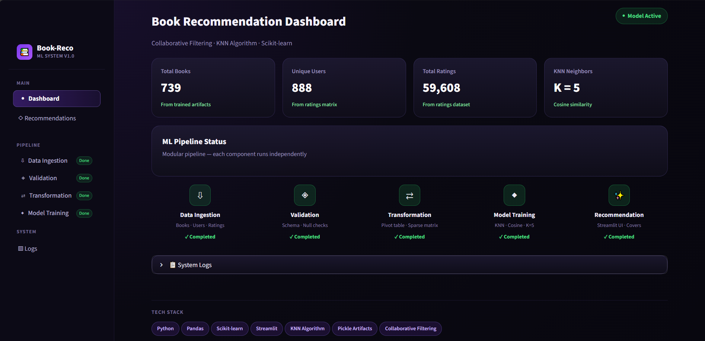
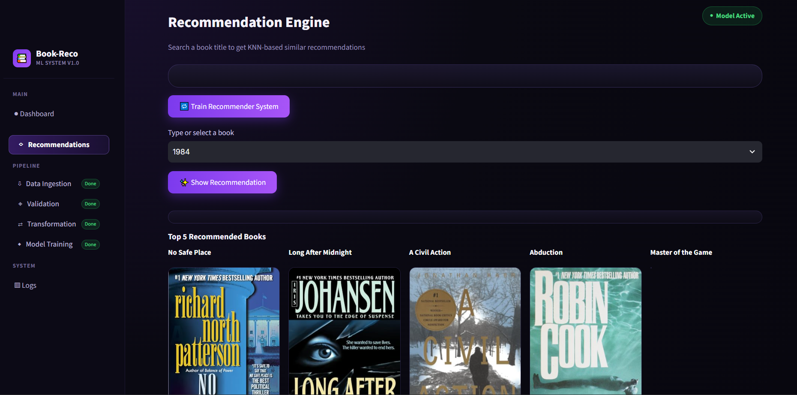

# 📚 Book Recommendation System

An end-to-end machine learning book recommendation system that uses **collaborative filtering** and **K-Nearest Neighbors (KNN)** to recommend books based on historical user-rating patterns.

The project combines data preprocessing, exploratory data analysis, rating-matrix construction, KNN-based similarity search, serialized ML artifacts, a modular training pipeline, and an interactive Streamlit application.

---

## 🎯 Problem Statement

With a large number of books available, users can find it difficult to discover books that match their interests.

The goal of this project is to build a recommendation system that can take a selected book and return other books with similar user-rating patterns.

---

## 💡 Solution

The system uses **item-based collaborative filtering**.

Instead of comparing books using their descriptions or genres, the system represents each book by the ratings it received from users.

Books with similar rating patterns are treated as similar and are retrieved using K-Nearest Neighbors.

### High-level workflow

```text
Books.csv
Users.csv
Book-Ratings.csv
       │
       ▼
Data Ingestion
       │
       ▼
Data Validation & Preprocessing
       │
       ├── Select relevant columns
       ├── Rename columns
       ├── Filter active users
       ├── Merge ratings with book metadata
       └── Filter sufficiently-rated books
       │
       ▼
Clean Rating Dataset
       │
       ▼
Book × User Rating Matrix
       │
       ▼
Sparse Matrix
       │
       ▼
K-Nearest Neighbors
       │
       ▼
Similar Books
       │
       ▼
Book Metadata + Cover Images
       │
       ▼
Streamlit Application
```

---

## 🛠️ Tech Stack

- **Python**
- **Pandas**
- **NumPy**
- **SciPy**
- **Scikit-learn**
- **Streamlit**
- **Pickle**
- **Jupyter Notebook**
- **YAML**
- **Git / GitHub**

---

## ⚙️ Installation

Clone the repository and move into the project directory:

```bash
git clone <YOUR_GITHUB_REPOSITORY_URL>
cd Book-Recommendation-System
```

Install the dependencies:

```bash
python -m pip install -r requirements.txt
```

---

## 🚀 Running the Project

### 1. Run the training pipeline

```bash
python main.py
```

This executes:

```text
Data Ingestion
→ Data Validation
→ Data Transformation
→ Model Training
```

### 2. Launch the Streamlit application

```bash
python -m streamlit run app.py
```

The application then provides the interactive recommendation interface.

---

## 📸 Application

Add screenshots of the final Streamlit application here.

Recommended screenshots:

- Main dashboard
- Recommendation results
- Training/pipeline view
- EDA notebook

Example:

```markdown



```

---

## 🧠 Recommendation Approach

### Collaborative Filtering

The recommendation engine is based on **collaborative filtering**.

The system does not primarily ask:

> "Which books have similar text?"

Instead, it asks:

> "Which books have similar rating behavior across users?"

For example, if two books are repeatedly rated similarly by the same users, they can be considered similar.

### User-Book Rating Matrix

The cleaned rating data is transformed into a matrix:

```text
                 User 1   User 2   User 3   User 4
Book A              5        0        4        0
Book B              5        0        5        0
Book C              1        4        0        5
```

- Rows represent books.
- Columns represent users.
- Values represent ratings.
- Missing ratings are represented as `0` after filling missing values.

This matrix becomes the input representation for the KNN model.

### K-Nearest Neighbors

The project uses `NearestNeighbors` from scikit-learn with a brute-force search.

The rating matrix is converted into a sparse CSR matrix before fitting the model.

For a selected book:

1. Find the book's row in the rating matrix.
2. Pass that row to KNN.
3. Retrieve its nearest neighbors.
4. Map the neighbors back to book titles.
5. Retrieve their cover URLs from the processed book metadata.
6. Display the top recommendations in Streamlit.

The application requests **6 neighbors**, including the selected book itself, and displays the other **5 recommendations**.

---

## 📊 Dataset

The project works with three CSV files:

| File | Description |
|---|---|
| `Books.csv` | Book metadata such as ISBN, title, author, publication year, publisher and image URLs |
| `Users.csv` | User information |
| `Book-Ratings.csv` | User-book rating interactions |

### Dataset exploration

The EDA notebook inspected the three datasets before building the recommendation matrix.

The notebook found:

- `Books.csv`: **271,360 rows and 8 columns**
- `Users.csv`: **278,858 rows and 3 columns**
- `Book-Ratings.csv`: **526,356 rows and 3 columns**

The ratings data contains both explicit ratings and zero-valued interactions.

---

## 🧪 Exploratory Data Analysis

The `Books_EDA.ipynb` notebook was used to explore the raw data and develop the recommendation approach.

The notebook includes:

- Dataset loading and inspection
- Dataset shapes and columns
- Rating-frequency analysis
- Active-user filtering
- Joining ratings with book metadata
- Book rating-count analysis
- Filtering books based on rating frequency
- Pivot-table construction
- Sparse-matrix conversion
- KNN experimentation
- Testing recommendations for individual books

For example, the notebook builds a sparse matrix with **703 books × 888 users** after preprocessing and uses `NearestNeighbors` to retrieve similar books.

---

## 🤖 Model

### Algorithm

**K-Nearest Neighbors**

```python
NearestNeighbors(algorithm="brute")
```

The model is fitted on the sparse book-user rating matrix.

The recommendation process uses the selected book's rating vector and searches for nearby vectors.

### Why KNN?

KNN is useful here because the recommendation problem can be expressed as a similarity-search problem:

```text
Book → Rating Vector → Similar Rating Vectors → Recommended Books
```

The brute-force implementation is straightforward for the relatively small transformed matrix used by the final system.

---

## 🔄 Training Pipeline

The project separates the ML workflow into independent components.

```text
Data Ingestion
      ↓
Data Validation
      ↓
Data Transformation
      ↓
Model Training
```

The `TrainingPipeline` initializes each component and executes them sequentially.

### Pipeline components

| Component | Responsibility |
|---|---|
| Data Ingestion | Handles the input dataset stage |
| Data Validation | Cleans and validates the source datasets |
| Data Transformation | Builds the book-user rating matrix and serialized artifacts |
| Model Trainer | Trains the KNN model |
| Training Pipeline | Orchestrates the complete workflow |

The pipeline can be started through:

```bash
python main.py
```

---

## 🏗️ Project Architecture

The project follows a modular ML-project structure rather than placing the complete workflow in one notebook.

```text
Book Recommendation System/
│
├── app.py
├── main.py
├── Books_EDA.ipynb
├── config/
│   └── config.yaml
│
├── data/
│   ├── Books.csv
│   ├── Users.csv
│   ├── Book-Ratings.csv
│   └── models/
│
├── artifacts/
│   ├── book_names.pkl
│   ├── book_pivot.pkl
│   └── final_rating.pkl
│
└── books_recommender/
    ├── components/
    │   ├── data_ingestion.py
    │   ├── data_validation.py
    │   ├── data_transformation.py
    │   └── model_trainer.py
    │
    ├── config/
    │   └── configuration.py
    │
    ├── constant/
    │   └── __init__.py
    │
    ├── entity/
    │   └── config_entity.py
    │
    ├── exception/
    │   └── exception_handler.py
    │
    ├── log_details/
    │   └── log.py
    │
    ├── pipeline/
    │   └── training_pipeline.py
    │
    └── utils/
        └── utils.py
```

---

## ⚙️ Configuration Management

Configuration is maintained separately in:

```text
config/config.yaml
```

The configuration layer reads these settings and converts them into configuration objects used by the pipeline components.

This keeps paths and pipeline settings separate from the implementation code and reduces hard-coded configuration throughout the project.

---

## 🛡️ Exception Handling and Logging

The project includes dedicated modules for:

- Custom exception handling
- Centralized logging
- Utility functions

Errors are wrapped through the project's custom `AppException` mechanism so that failures can be reported with useful debugging information.

The Streamlit interface also provides a system-log view for recent application logs.

---

## 🖥️ Streamlit Application

The project includes an interactive Streamlit interface.

### Main functionality

- Dashboard view
- Recommendation engine
- Book selection through a searchable/selectable list
- KNN-based recommendations
- Book cover display
- Model training trigger
- Application logs
- Pipeline status information

### Recommendation flow

```text
Select a book
      ↓
Load trained KNN model
      ↓
Load book-user matrix
      ↓
Find selected book
      ↓
KNN nearest-neighbor search
      ↓
Retrieve recommended titles
      ↓
Retrieve cover URLs
      ↓
Display 5 recommendations
```
--- 

## 🔮 Future Improvements

Possible extensions include:

1. **Hybrid Recommendation System**
   - Combine collaborative filtering with content-based filtering.

2. **Cold-Start Handling**
   - Use book metadata for books with insufficient ratings.

3. **Recommendation Evaluation**
   - Add ranking metrics such as Precision@K, Recall@K and NDCG@K.

4. **Better Similarity Modeling**
   - Experiment with different distance/similarity measures and scalable nearest-neighbor methods.

5. **API Layer**
   - Expose the recommendation engine through FastAPI.

6. **Automated Retraining**
   - Retrain the recommendation model when new rating data becomes available.

7. **Deployment**
   - Deploy the Streamlit application for public access.

---

## 📌 Key Takeaways

This project demonstrates an end-to-end workflow covering:

- Data exploration
- Data preprocessing
- Collaborative filtering
- User-item matrix construction
- Sparse matrix representation
- KNN similarity search
- Modular ML pipeline design
- Configuration management
- Exception handling
- Logging
- Model serialization
- Interactive Streamlit application

---

## 👨‍💻 Author

**Shivang Singh**

Computer Science Engineering — AI/ML

GitHub: [Add your GitHub profile]

LinkedIn: [Add your LinkedIn profile]
